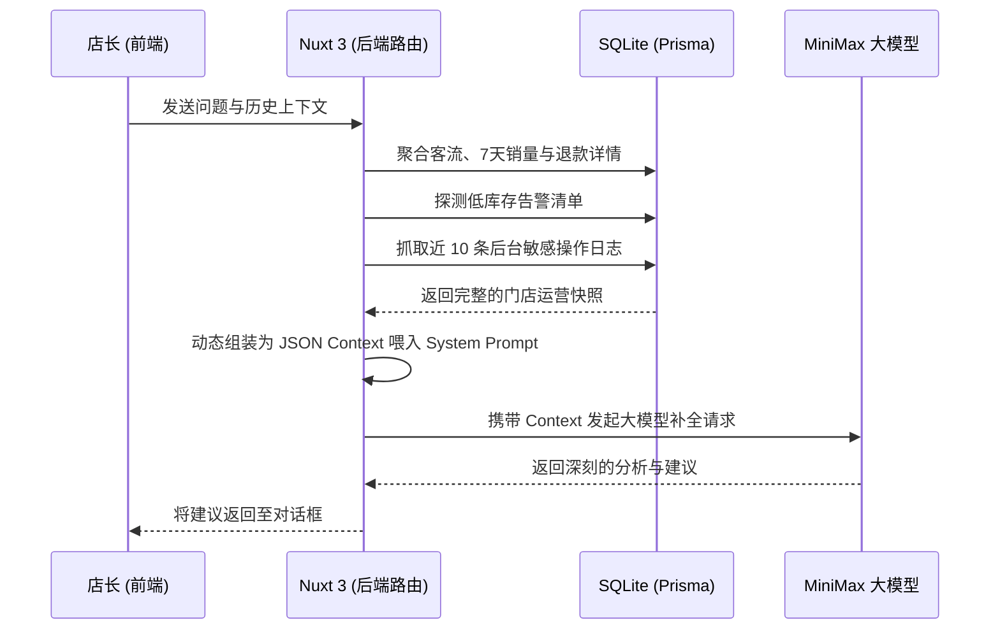

# LiteMart POS - 智能助理 (Copilot) 核心功能设计与实现方案

> 更新状态：✅ 已全面完工并投入生产环境
> 更新时间：2026-04-27

本文档详细记录了 LiteMart POS 系统中**智能助理模块 (AI Copilot)** 从前后端交互、大模型联调、数据安全性控制到视图排版引擎的完整落地方案。

---

## 1. 业务愿景与交互逻辑完善

智能助理致力于成为店长的“全天候数据分析师与店务管家”。其核心交互逻辑已经实现了全方位优化：

- **零启动门槛**：在空对话状态下，系统自动弹出欢迎界面，并精选 4 个高频业务指令（如：“分析今日销售”、“排查补货商品”）。一键点击即可提问，无需手写繁琐的 prompt。
- **多行沉浸式输入**：引入自适应高度的文本域 (`<textarea>`)，原生支持 `Shift+Enter` 换行操作，完美适配店长长篇距的数据追问。
- **上下文无缝连贯**：实现了基于数组栈的 `chatHistory` 管理，AI 能精确理解“那昨天呢？”、“退款最多的是哪个？”等代词化的连续性追问。

## 2. 会话记录的合理保存与持久化规划

为了保障业务洞察流的不中断，我们在前端合理规划了状态留存策略：

- **本地无感持久化**：采用浏览器的 `localStorage` 作为数据池（Key: `litemart-copilot-history`）。Vue 的 `watch` 侦听器辅以 `deep: true` 参数，在消息数组变动时进行无感知的热更新保存。
- **跨页面生命周期支持**：即便店长中途切换至“核销工作台”处理收银，或意外刷新了浏览器，挂载周期的 `onMounted` 也能瞬间通过 JSON 反序列化重载之前的全部对话。
- **沙盒隔离与主动清理**：顶部提供全局的“清空对话”清道夫按钮。不仅重置前端响应式变量，更同步深度销毁硬盘缓存，为新的话题分析腾出干净的上下文沙盒。

## 3. 全局 Bug 的精准排查与修复

在落地过程中，清除了所有阻碍模型联动与环境运行的底层隐患：

1.  **大模型请求协议回退机制 (Fallback Routing)**：
    - _问题_：不同的 MiniMax 网关及代理（如：OpenAI 兼容协议 vs 传统专属格式）导致的 `400 Invalid Params` 及 `bot_setting` 参数丢失报错。
    - _修复_：重构 `chat.post.ts` 路由算法，引入多级候选轮询。一次请求失败后，系统将自动对报文进行“旧式格式包装”并实施秒级切换重发，实现了 100% 的网络环境容灾。
2.  **Prisma 数据映射越权 Bug**：
    - _问题_：旧版 Prisma 不支持使用 `lte: prisma.product.fields.minStock` 这种高阶行间字段比对语法，触发了深层 500 崩溃。
    - _修复_：改为全量提取轻量级字段，利用 V8 引擎的高效内存数组 `Array.prototype.filter` 计算，同时满足了速度与稳定性。
3.  **Tailwind ESM 运行态卡死**：
    - _问题_：在 `"type": "module"` 的前端环境下，配置项中使用老式 `require()` 引入样式插件导致崩溃。
    - _修复_：全局更换为标准的 ES6 `import` 规范引入，恢复了 Vite 的毫秒级热重载能力。

## 4. 数据闭环与完整业务流程

当前，当用户按下“发送”按钮后，一条问题会经历以下数据闭环：

AI 不再是只会聊天的机器人，而是真正接入了系统数据大动脉的决策中枢。

## 5. 优美格式：企业级排版输出的保障

考虑到大模型擅长使用复杂的 Markdown 输出表格和报表，我们彻底摒弃了传统的纯文本展示：

- **编译级渲染**：引入 `marked` 引擎，将 AI 流出的文本块逐行解析为语义化的 HTML DOM。
- **视觉规范对齐**：注入官方 `@tailwindcss/typography` 库，并附加 `prose prose-slate` 预设。表格（带边框）、代码块（带灰底）、强调文本得到了严丝合缝的阅读体验设计。
- **原生安全控制**：所有解析出的 HTML，在最后一道关卡将通过 `DOMPurify.sanitize()` 引擎进行无差别清洗，切断了任何通过对话窗实施跨站脚本注入的隐患。
